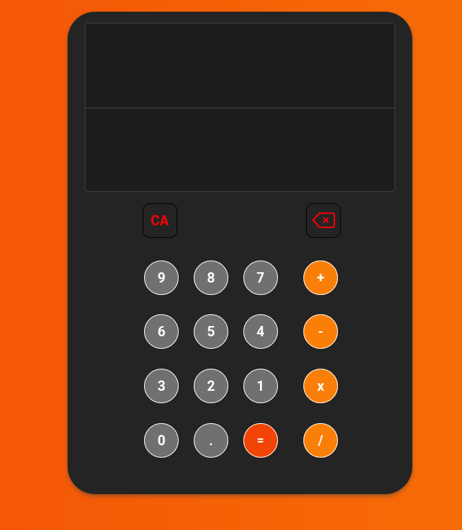

# Calculadora web

Um projeto prático para estudar a manipulação de DOM com javascript. A calculadora conta com um design simples e uma "leve" responsividade, pois, o grande foco é nas operações que ela consegue fazer e como certos elementos se comportam com a intereção com o usuário.

###

###

